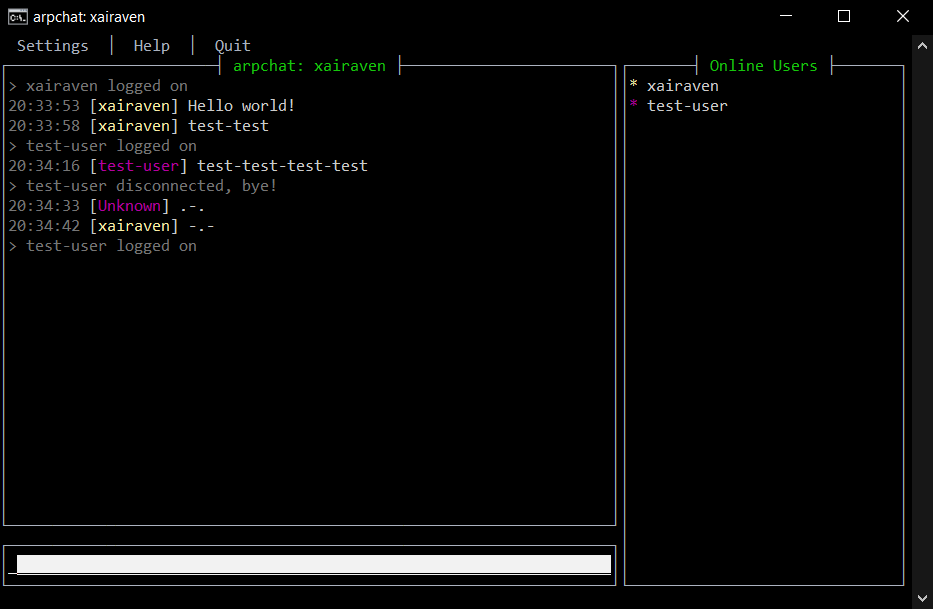
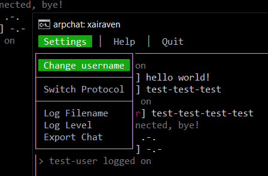
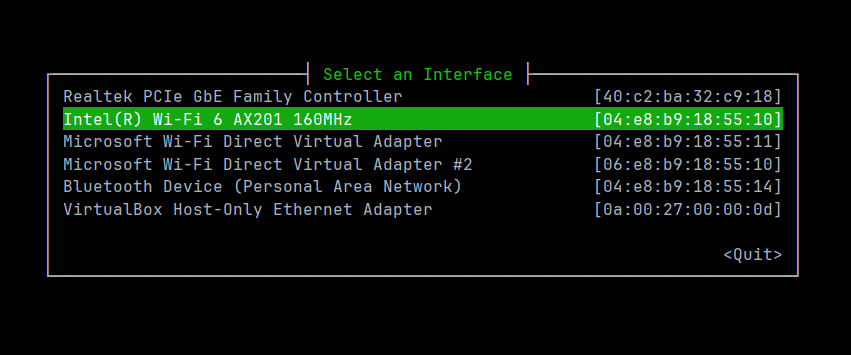

# xArpChat

**ARP Chat** is a **console-based chat application** written in 🦀Rust🦀 that uses the **ARP** *(Address Resolution Protocol)* for messaging over a local network.


---

This project is a **rewritten version** of the [original arpchat](https://github.com/kognise/arpchat) created by [kognise](https://github.com/kognise).

The primary goal of this rewrite was to **gain hands-on experience** with **network programming in 🦀Rust🦀**.

While this version introduces some new features, it is *not meant to be an improvement on the original*.

Instead, it serves as an exploration of **ARP**, a protocol traditionally used to map IP addresses to MAC addresses, repurposed here for **direct communication between devices**.



---

## Key Features

The original ARP Chat implementation supports sending messages tens of thousands of characters long,
thanks to a transport protocol built on top of ARP (which I named *KTP — Kognise's Transport Protocol*), with a bit of compression added.

There's even a presence discovery and heartbeat system, which not only provides join and leave notifications
but also maintains an updated list of online users.

For more technical details, check out the [article written](https://kognise.dev/writing/arp) by the original author.

In this rewritten version, I've added several **new features**:

- Written on **stable Rust 1.81** (the original was written on an *older nightly (beta) version*).
- **Refactored** and **stabilized** the codebase (but I'm bad at programming, so don't judge me too harshly :)
- **Updated dependencies** and adjusted the code to accommodate **breaking changes**.
- Added **logging** functionality.
- Introduced **localization** (currently available in English and Ukrainian).
- Implemented the ability to **export chat**.
- Added a **help window**.
- Made various other **minor improvements**.

This project builds on the solid foundation of the original while bringing it up to date and adding a few enhancements.



## Running

You can download program from the [releases page](https://github.com/xairaven/arpchat-rs/releases/latest).

### Windows:
You'll likely need to install [Npcap](https://npcap.com/#download). During installation, make sure to check the option "Install Npcap in WinPcap API-compatible Mode."

### Linux:
`libpcap` is already installed on most Linux distros. But to avoid running the program under `sudo` every time, you may have to grant privileges:

```
sudo setcap CAP_NET_RAW+ep /path/to/arpchat
```

After that, just run the binary in a terminal. If you see your own messages when you send them, everything is working correctly. If not, try selecting a different interface or protocol.



**Encounter any issues?** Feel free to open an issue (or make a **pull-request**), and I'll likely help you out.

## Building the Project
Simply clone the project and start working!

```
git clone https://github.com/xairaven/arpchat-rs.git
cd arpchat-rs
cargo build
```

If you are using **Windows**, download the **[WinPcap Developer's Pack](https://www.winpcap.org/devel.htm)**. You will need the `Packet.lib` file, which is located in `WpdPack/Lib/x64/`.

There are a couple of ways to link it:
- Set the `LIB` environment variable to the path of this file.
- The project includes a special [build.rs](https://github.com/xairaven/arpchat-rs/blob/bafd21595acf883b081482a36969428f47de7197/build.rs) file. It specifies the search for libraries to link in the `lib` directory, if such a directory exists at the root of the project (at the same level as `src`).
- **A less recommended option:** add the file to the *toolchain libraries*. An example path is:

```
C:\Users\<Your-User>\.rustup\toolchains\<Your-Toolchain>\lib\rustlib\<Same-Toolchain>\lib\Packet.lib
```

